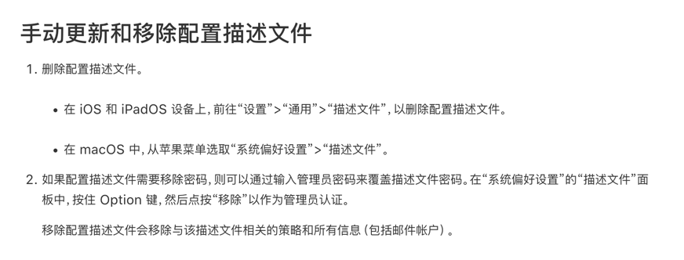

Mac安全技巧
=

#### 写在前面
为什么要写这一篇？属实是被mac上的安全软件坑苦了，记录以下跟安全软件做斗争的关键战斗。


### 描述文件
[手动更新和移除配置描述文件](https://support.apple.com/zh-cn/guide/profile-manager/pmdbd71ebc9/mac)  


### 系统扩展（System Extensions）
某些安全软件会将对app的限制（例如不允许打开微信）写入到系统扩展中，非常难以发现和卸载。
#### 系统扩展操作
```bash
# 列出所有系统扩展
sudo systemextensionsctl list
# 删除系统扩展，执行删除操作需要先关闭sip
# 系统完整性保护（System Integrity Protection，SIP）
sudo systemextensionsctl uninstall <开发者团队ID> <扩展标识符>
```
#### SIP
```bash
# 进入mac恢复模式
intel芯片重启后按cmd+r类操作
apple芯片关机后长按开机键
# 关闭sip
csrutil disable
# 开启sip
csrutil enable
```
