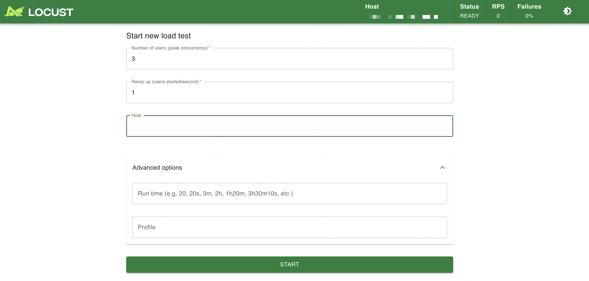
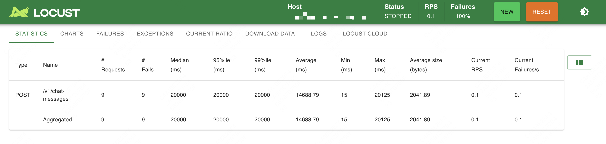
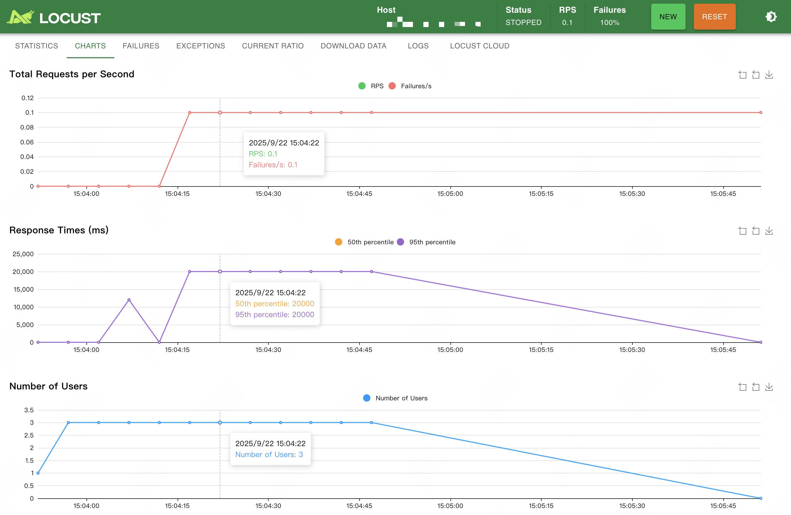
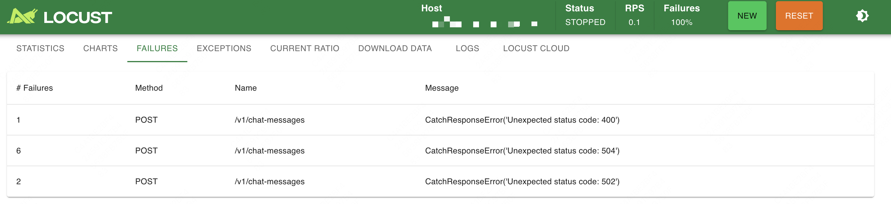

Locust
=


### 1.安装
```bash
# so easy
pip install locust
locust -V
```

### 2.准备工作
测试脚本 locust_file.py
```python
from locust import HttpUser, task, between

class MyUser(HttpUser):
    # 每个虚拟用户请求之间的等待时间（秒）
    wait_time = between(1, 5)

    @task
    def get_index(self):
        self.client.get("/")

    @task
    def get_users(self):
        self.client.get("/api/users")
```
脚本说明
* HttpUser：基于 HTTP 协议的用户模拟类
* task：定义一个测试任务（可以有多个）
* between(1, 5)：每次请求之间随机等待 1~5 秒

### 3.测试服务启动
```bash
# 文件路径(locust_file.py)和host替换为真实的
locust -f locust_file.py --host http://127.0.0.1:5000
```

### 4.Web UI开始测试
进入 Web UI 后：
1. 输入要模拟的 用户数（Number of users to simulate）
2. 输入 启动速率（Spawn rate，多少用户/秒）
3. 填写 目标 host（如果命令行没指定的话）
4. 点击 Start Swarming 开始压测



Web 界面能实时看到：
* 请求总数
* RPS（Requests per second）
* 响应时间曲线
* 错误率




